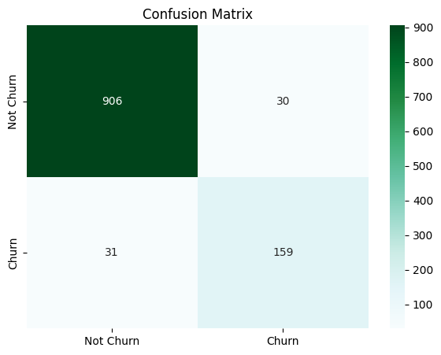
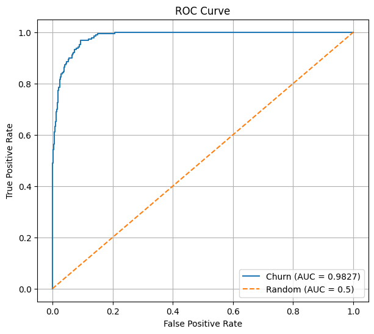

# E-Commerce Customer Churn Classification Using Random Forest

A machine learning project to predict whether a customer is likely to stop using an e-commerce service, using the Random Forest classification algorithm.

---

## Overview

Customer churn is one of the biggest challenges in the e-commerce industry. Losing customers is costly — acquiring new ones is significantly more expensive than retaining existing ones. This project aims to build a classification model that can identify high-risk churn customers early, enabling businesses to take proactive retention actions before customers leave.

The model is trained on a publicly available e-commerce dataset and evaluated using standard classification metrics including accuracy, precision, recall, F1-score, and ROC-AUC.

---

## Classification Target

| Class | Description |
|-------|-------------|
| 0 | Customer does not churn (retained) |
| 1 | Customer churns (stops using the service) |

---

## Dataset

- **Source**: Public dataset (Medium — E-Commerce Dataset)
- **Total Records**: 5,630 customers
- **Features**: 19 columns (before preprocessing)
- **Target**: `Churn` (0 = Not Churn, 1 = Churn)
- **Class Distribution**: 83.2% Not Churn / 16.8% Churn

---

## Features Used

| Feature | Description |
|---------|-------------|
| Tenure | Length of time the customer has been using the service |
| CityTier | City tier of the customer's location |
| WarehouseToHome | Distance from warehouse to customer's home |
| HourSpendOnApp | Hours spent on the mobile app |
| NumberOfDeviceRegistered | Number of devices registered by the customer |
| SatisfactionScore | Customer satisfaction rating |
| NumberOfAddress | Number of addresses registered |
| Complain | Whether the customer filed a complaint (0/1) |
| OrderAmountHikeFromlastYear | Percentage increase in order amount from last year |
| CouponUsed | Number of coupons used |
| OrderCount | Total number of orders placed |
| DaySinceLastOrder | Days since the last order |
| CashbackAmount | Average cashback received |
| PreferredLoginDevice | Preferred device for login |
| PreferredPaymentMode | Preferred payment method |
| Gender | Customer gender |
| PreferedOrderCat | Preferred order category |
| MaritalStatus | Marital status |

---

## Methodology

### 1. Exploratory Data Analysis (EDA)
- Checked target distribution, missing values, and descriptive statistics
- Analyzed churn rate per categorical feature (login device, payment mode, order category, marital status)
- Computed correlation between numerical features and churn target

### 2. Feature Engineering
- Dropped `CustomerID` (non-informative identifier)
- Imputed missing values in 7 numerical columns using **median** (chosen over mean due to skewed distributions)
- Applied **one-hot encoding** to all categorical features (low cardinality, no target encoding needed)

### 3. Train-Test Split
- Used **stratified random split** (80% train / 20% test) to preserve class distribution across both sets

### 4. Model Training
- Algorithm: **Random Forest Classifier**
- Hyperparameters: `n_estimators=200`, `max_depth=10`, `class_weight='balanced'`, `random_state=42`
- `class_weight='balanced'` applied to handle class imbalance (83% non-churn vs 17% churn)

### 5. Evaluation
- Metrics: Accuracy, Precision, Recall, F1-Score, ROC-AUC
- Visualizations: Confusion Matrix, ROC Curve, Feature Importance

---

## Performance and Results

### Model Evaluation

| Metric | Score |
|--------|-------|
| Accuracy | 94.6% |
| Precision | 84.1% |
| Recall | 83.7% |
| F1-Score | 83.9% |
| ROC-AUC | 0.983 |

### Classification Report

|  | Precision | Recall | F1-Score | Support |
|--|-----------|--------|----------|---------|
| Not Churn (0) | 0.97 | 0.97 | 0.97 | 936 |
| Churn (1) | 0.84 | 0.84 | 0.84 | 190 |
| **Accuracy** | | | **0.95** | **1126** |

### Top 10 Feature Importance

| Feature | Importance |
|---------|------------|
| Tenure | 28.44% |
| CashbackAmount | 9.06% |
| Complain | 7.23% |
| DaySinceLastOrder | 6.03% |
| WarehouseToHome | 5.17% |
| NumberOfAddress | 4.51% |
| OrderAmountHikeFromlastYear | 4.12% |
| SatisfactionScore | 3.95% |
| NumberOfDeviceRegistered | 2.87% |
| MaritalStatus_Single | 2.73% |

### Confusion Matrix

  

Out of 190 actual churn cases, 159 were correctly identified and only 31 were missed.

### ROC Curve

  

ROC Curve shows an AUC of 0.9827 — the model is highly capable of distinguishing between churned and retained customers. The curve approaching the top-left corner indicates classification performance far above the random baseline (AUC = 0.5).
---

## Software Stack

- Python
- Pandas & NumPy
- Scikit-learn
- Matplotlib & Seaborn

---

## Business Insight

**Tenure** is the most influential feature (28.4%), confirming that newly joined customers carry the highest churn risk. Companies should prioritize retention efforts in the early months through onboarding programs or new-user incentives. **CashbackAmount** (9.1%) indicates that cashback programs are effective retention tools. Meanwhile, **Complain** (7.2%) signals that unresolved complaints are a strong churn trigger — fast and satisfactory complaint handling is critical.

This model can be deployed as a churn early warning system, enabling businesses to proactively target high-risk customers with personalized retention strategies before they leave.

---

## Future Improvements

- Experiment with other algorithms (XGBoost, LightGBM) and compare performance
- Apply hyperparameter tuning using GridSearchCV or RandomizedSearchCV
- Build a simple inference interface for real-time churn prediction
